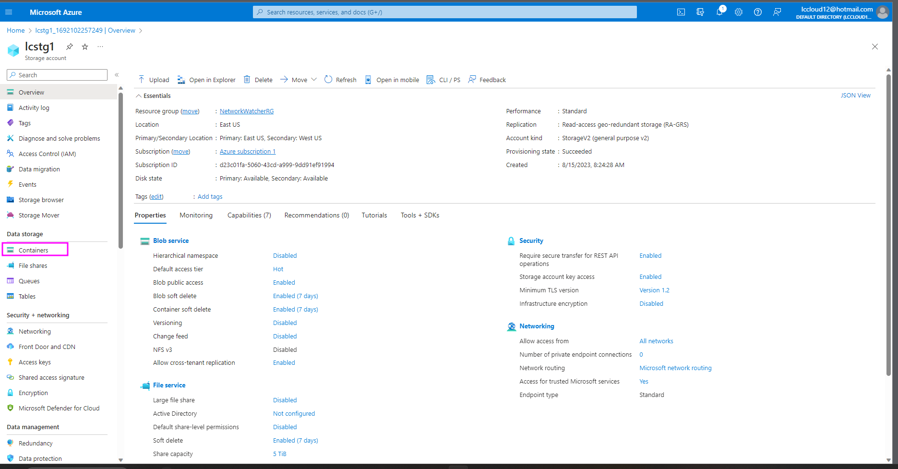

# Azure Storage Lab

### Creating a Blob Storage 

* Login into the Azure portal and select create Resource 
* Go to Categories click storage, look for Storage Account select create 

#### Select Storage Account

* Fill in the below List 
  * Storage Account Nmae &rarr; Give is a unique global name 
  * Select Region &rarr; Select Region 
  * Perfomance &rarr; Select Perfomance (Standard and Prmium)
  * Redundancy &rarr;  Select Redundancy (LRS, GRS, ZRS, GZRS) [More on Redundancy](https://learn.microsoft.com/en-us/azure/storage/common/storage-redundancy)
  * Access Tier  &rarr; Hot and Cool 

 #### 1

#### 2

#### 2

* Select Resouces after the Stroage account is created . 

#### Deployment Complete 

* In the Resouce Contains are the azure blob services 

#### Containers 

* Click on containers and add y a new container note , there is a default containter located in the containers directory, this is a system container and it should not be tempered with 

* Select add container . 
* Type in the container and select the access level of the container 

#### Create a Container 

#### List Containers 

