## Azure Ad Lab
OverView

```bash
  1. log into the Portal and Click on Azure Active Directory 
```
    

## Azure Tanant 

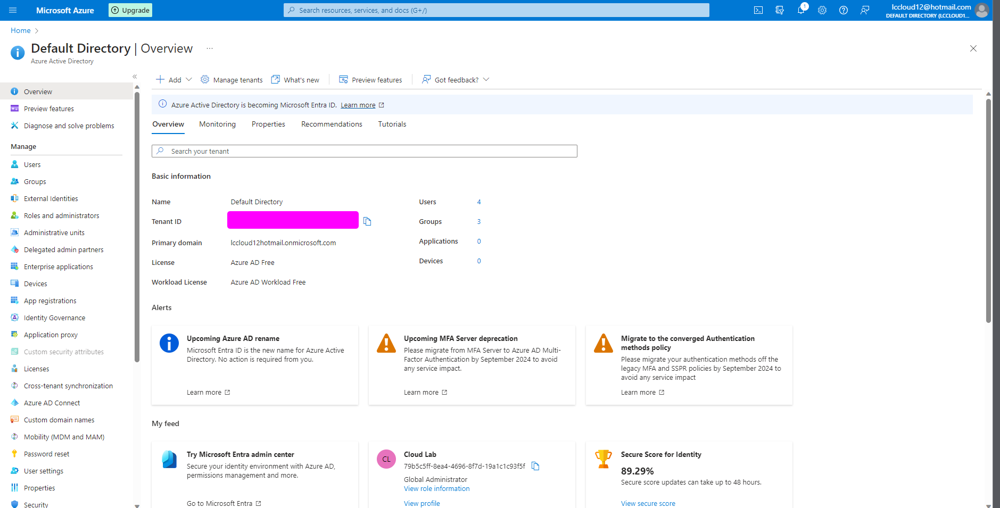

```bash
  2. Click on Azure Active Directory to lunch the Portal. 
  Dirctory name . this is your email address without any specail Characters 
  Domain Name . this is your directory name dot onmiscrosoft.com
  example robertcloud.onmicrosoft.com . not this can be change by purchasing a custom doamin 

  
```
## Keywords and highlights 

- Directory Name 

- Domain Name 


## Managing Azure AD with Powershell 
The first thing to do is to make sure you have Azure Active directory Module installed on your computer 

## Azure Ad With Powershell Basics 

Install AzureAd module 

```powershell
  install-module -name AzureAD -Force
```
Go Check if AzueAD module has been installed on your device 
```powershell
  GET-installedModule
```


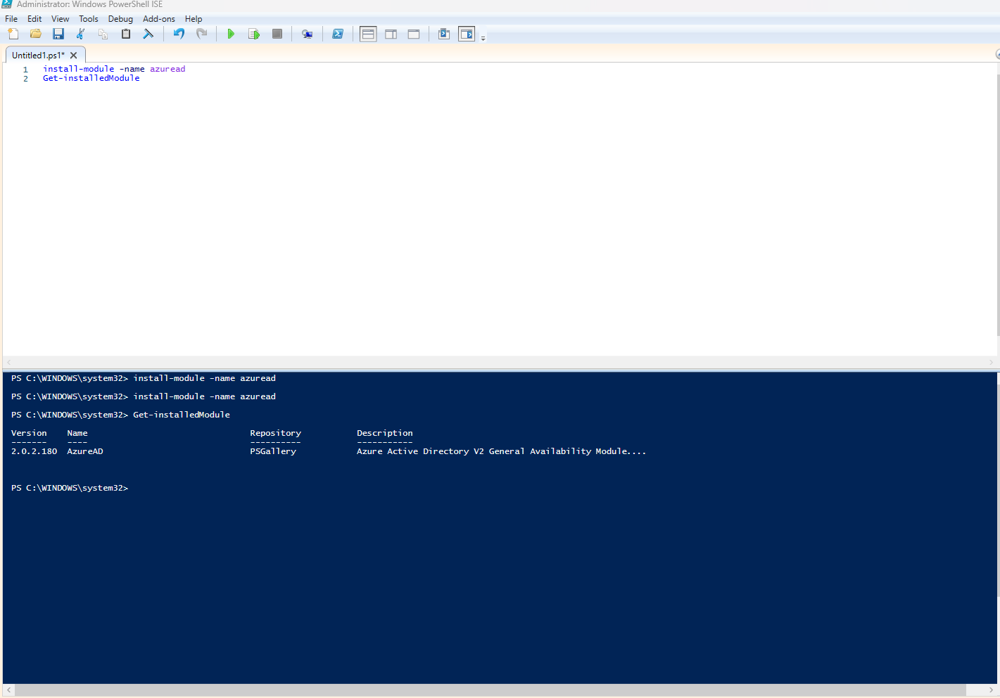

Connecting to AzureAd 

```powershell
  connect-Azuread -TenantId d4883360-3rft-43df-ae0e-8a26b3c33344
```


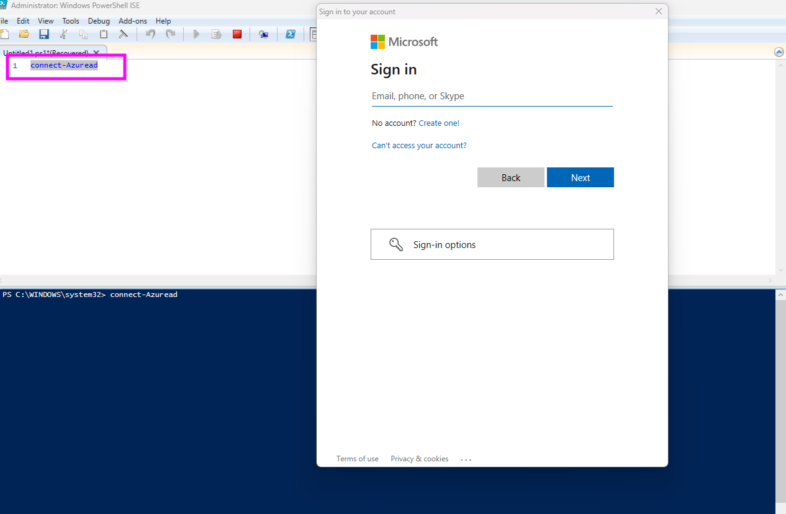


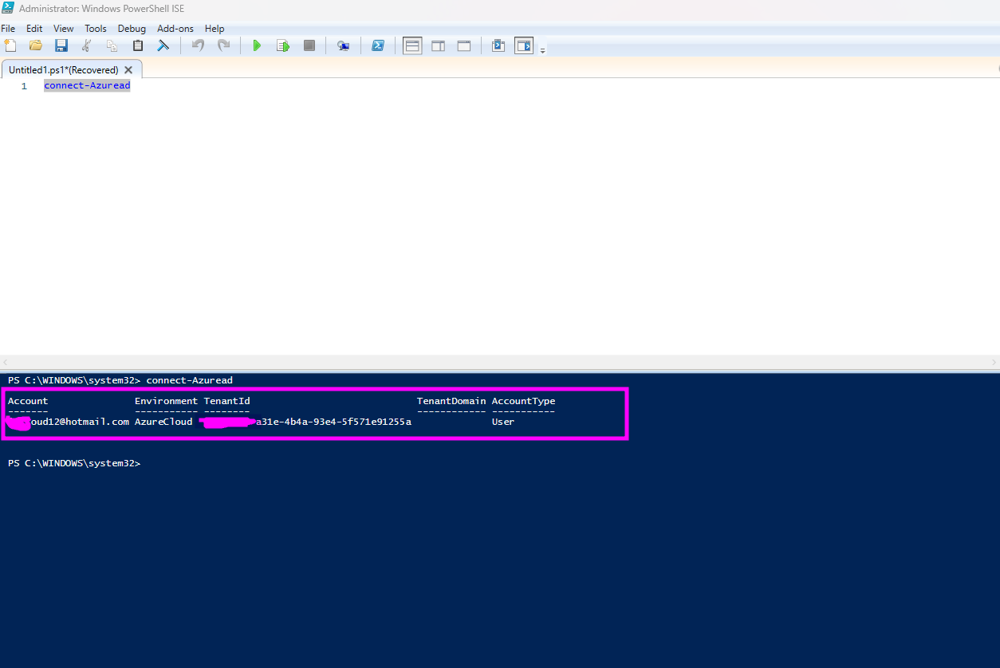


How to get Azure Ad users, Domain Details and TenantDeatils in Powershell 

```powershell
  connect-Azuread -TenantId d4883360-3rft-43df-ae0e-8a26b3c33344
  
  get-azureaduser
 
  Get-AzureADDomain

  Get-AzureADTenantDetail
```

#### The above code explain how to conect to AzureAd , get users , get Domain and Tenant Details 

- first commnad is use to connect to AzureAD
- Second command shows the list of user accounts in your Domain/Tenant
- Third command gets the domain details 
- Fourth Command Shows TernatID

Adding User To Azure Ad Via Powershell 


```powershell

connect-Azuread -TenantId d4883360-2ffb-8946-ae0e-8a26b3c554125
$PasswordProfile = New-Object -TypeName Microsoft.Open.AzureAD.Model.PasswordProfile
$PasswordProfile.Password = "userpassword"
New-AzureADUser -DisplayName "User10" -PasswordProfile $PasswordProfile -UserPrincipalName "User10@lccloud12hotmail.onmicrosoft.com" -AccountEnabled $true -MailNickName "User10"

```


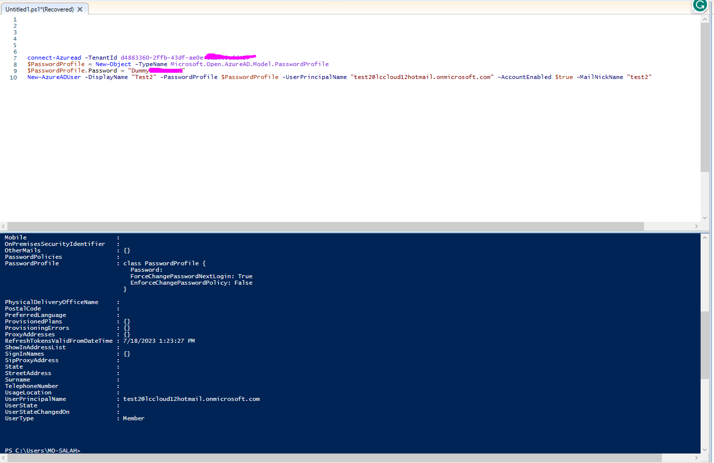


 


# Creating Groups in Azure Active Directory 

In Azure Active directory you can create two types of Groups 
* Select Azure Active Directory 
* Click on Groups
   
* Select New Group  
   
* There are two options Security groups and Office 365 Groups 
* Select group type 
* Create Group Name 
* Select Member type. Note memeber type will be visible or disabled depending on your subscription 
   * Direct Assigment
   * Group Assigment 
   * Rule-Based Assigment 
* Add owners 
* Add memebers 
    

### Group Settings 
* General 
  * Self Service Goup Management 
  * Restrict access to grops in the Access Panel 
  * Security Groups 
  * Office 365 Groups 
* Expiration
* Naming Policy
    


# Creating Groups in Azure Active Directory 

In Azure Active directory you can create two types of Groups 
* Select Azure Active Directory 
* If you want to create a group click on Groups 
* Select New Group  
* There are two options Security groups and Office 365 Groups 
* Select group type 
* Create Group Name 
* Select Member type. Note memeber type will be visible or disabled depending on your subscription  
   * Direct Assigment
   * Group Assigment 
   * Rule-Based Assigment 
* Add owners 
* Add memebers 

### Group Settings 
* General 
  * Self Service Goup Management 
  * Restrict access to grops in the Access Panel 
  * Security Groups 
  * Office 365 Groups 
* Expiration
* Naming Policy

# Creating Groups with Powershell 


Connect to Azure Ad 

```powershell
 connect-Azuread -TenantId d4883360-2ffb-43df-ae0e-8a26b3c6d427
```
 

Connect Account 

```powershell
 connect-AzAccount
```

Create Group 

```powershell
 New-AzADgroup -displayname GroupName -MailNickname GroupName
```
## Creating group in powershell 

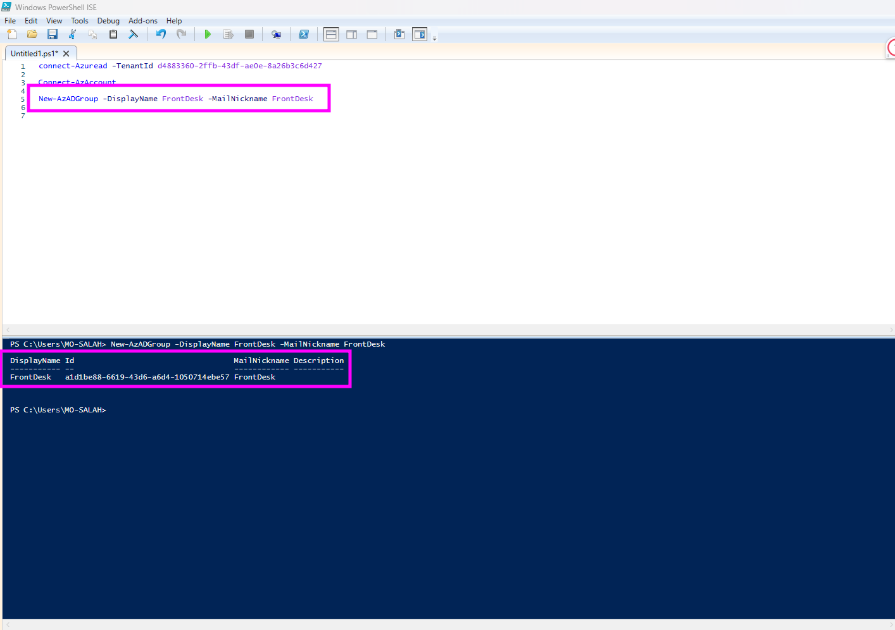  

Group created 

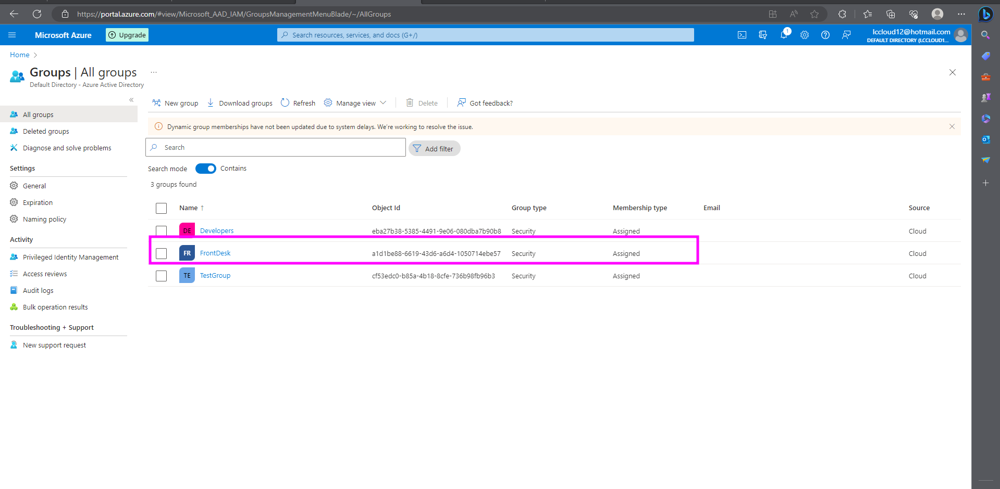  

 
 Add group member 

```powershell
 Add-AzADGroupMember -MemberUserPrincipalName "test1@lccloud12hotmail.onmicrosoft.com" -TargetGroupDisplayName GroupName
```

## 

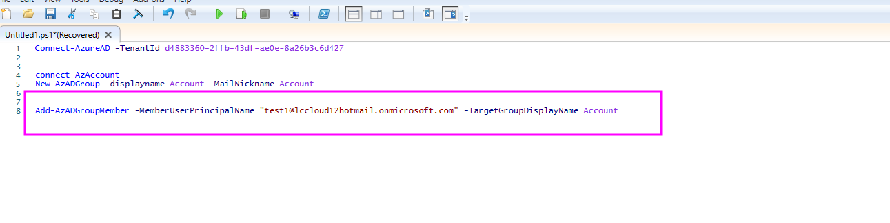  


 Get Members of a Group

```powershell
 Get-AzADGroupMember -GroupDisplayName GroupName
```


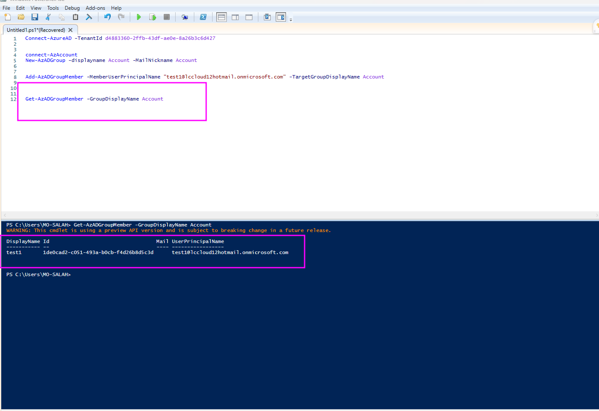  

 
 

# Azure Goveernance & Compliance 

### What is Management Group 
Management groups are containers that help you manage access, policy, and compliance across multiple subscriptions


**Creating Management Group**  


* Open Azure Portal 
* Search for Manage in search box 

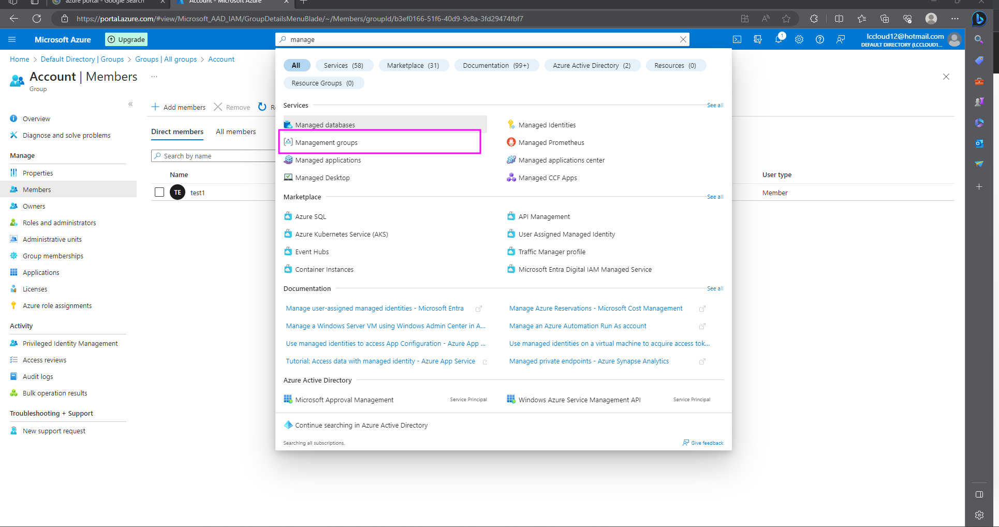  
* Select Create
  

* Select Add Management Group 


* Add management Group ID and Management Group Display Name 
* After that save and Refresh


### Create Management Group Using Powershell 
* Open powershell , this time we are going to use cloud shell 


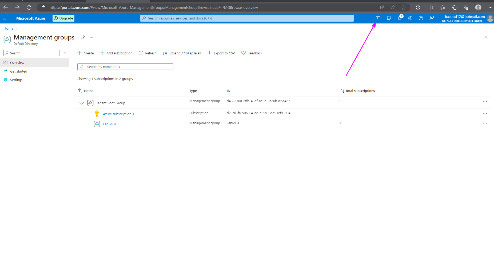

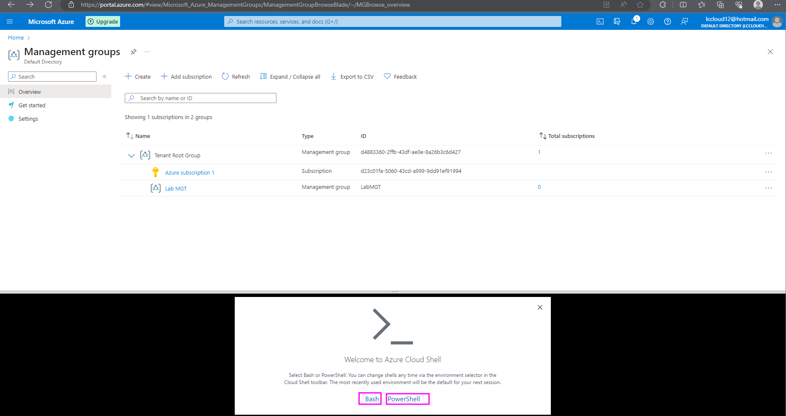

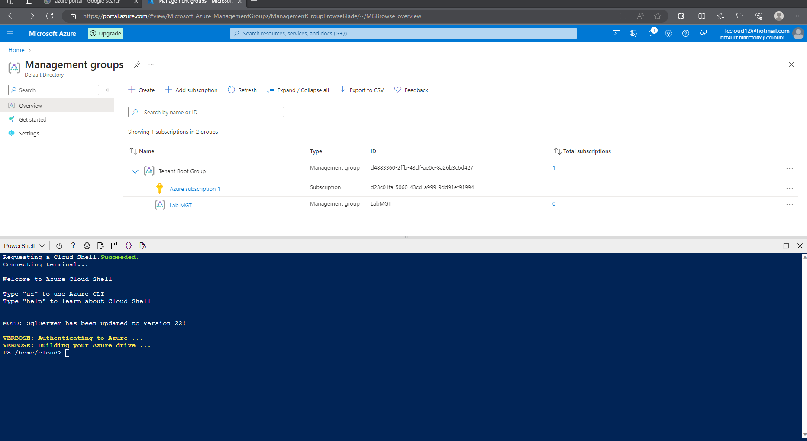

* Creating Management Group in Powershell 

```powershell 
  New-AzManagmentGroup -groupname "Group Name" -displayname "DisplayName" 
```


* List Management Groups note is the management does not appear on powershell, refresh management group from the portal 

```powershell 
  get-azmanagementgroup 
```

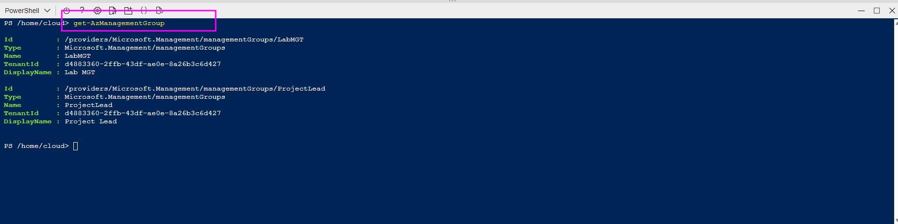
    


    

