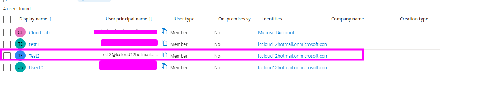

## Azure Ad Lab

## Installation

Install my-project with npm

```bash
  1. log into the Portal and Click on Azure Active Directory 
```
    

## Azure Tanant 


```bash
  2. Click on Azure Active Directory to lunch the Portal. 
  Dirctory name . this is your email address without any specail Characters 
  Domain Name . this is your directory name dot onmiscrosoft.com
  example robertcloud.onmicrosoft.com . not this can be change by purchasing a custom doamin 

  
```
## Keywords and highlights 

- Directory Name 

- Domain Name 


## Managing Azure AD with Powershell 
The first thing to do is to make sure you have Azure Active directory Module installed on your computer 

## Azure Ad With Powershell Basics 

Install AzureAd module 

```powershell
  install-module -name AzureAD -Force
```
Go Check if AzueAD module has been installed on your device 
```powershell
  GET-installedModule
```


Connecting to AzureAd 

```powershell
  connect-Azuread -TenantId d4883360-3rft-43df-ae0e-8a26b3c33344
```


How to get Azure Ad users, Domain Details and TenantDeatils in Powershell 

```powershell
  connect-Azuread -TenantId d4883360-3rft-43df-ae0e-8a26b3c33344
  
  get-azureaduser
 
  Get-AzureADDomain

  Get-AzureADTenantDetail
```

#### The above code explain how to conect to AzureAd , get users , get Domain and Tenant Details 

- first commnad is use to connect to AzureAD
- Second command shows the list of user accounts in your Domain/Tenant
- Third command gets the domain details 
- Fourth Command Shows TernatID

Adding User To Azure Ad Via Powershell 


```powershell

connect-Azuread -TenantId d4883360-2ffb-8946-ae0e-8a26b3c554125
$PasswordProfile = New-Object -TypeName Microsoft.Open.AzureAD.Model.PasswordProfile
$PasswordProfile.Password = "userpassword"
New-AzureADUser -DisplayName "User10" -PasswordProfile $PasswordProfile -UserPrincipalName "User10@lccloud12hotmail.onmicrosoft.com" -AccountEnabled $true -MailNickName "User10"

```


